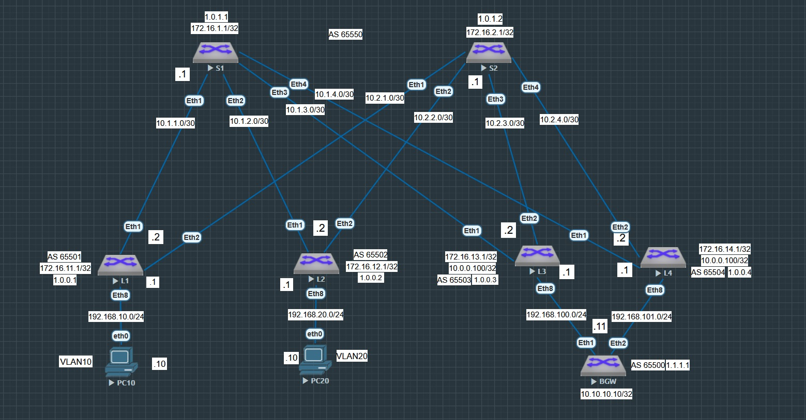
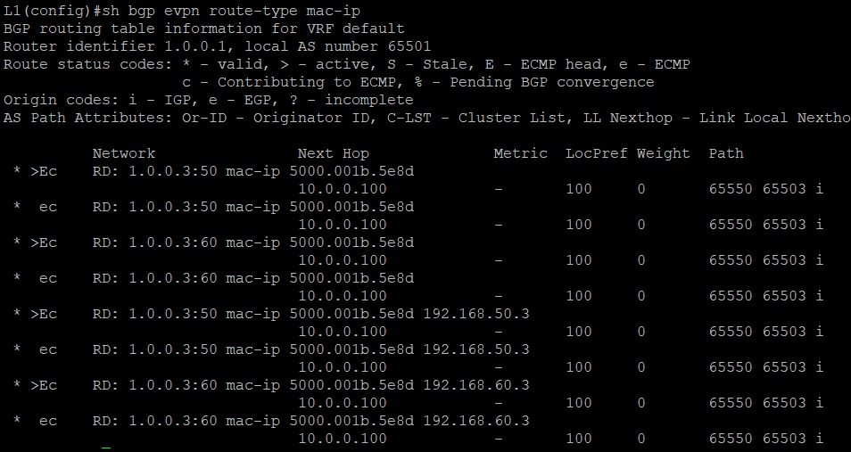
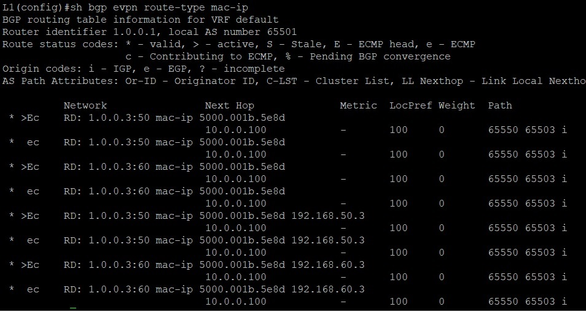
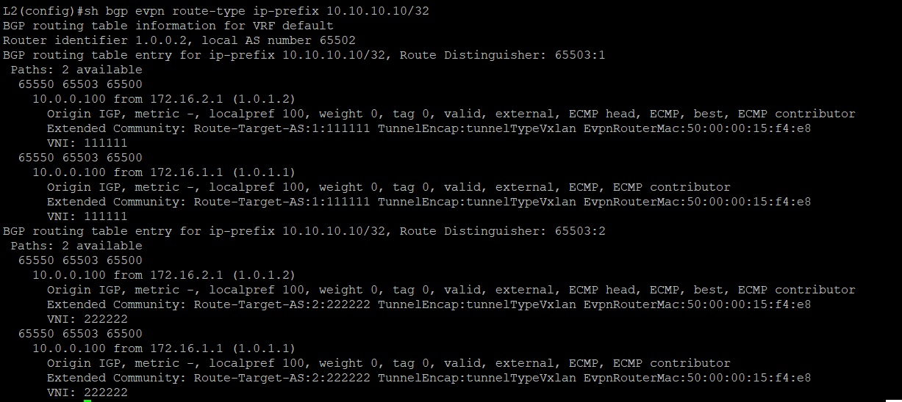
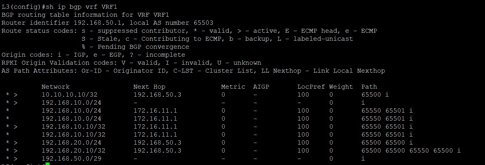
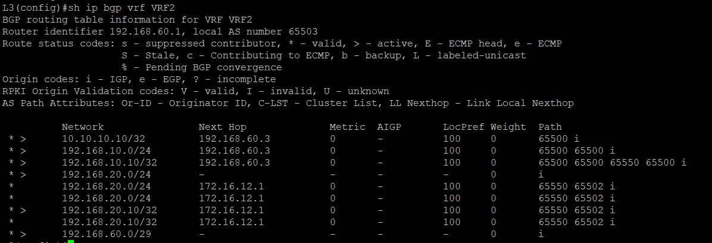
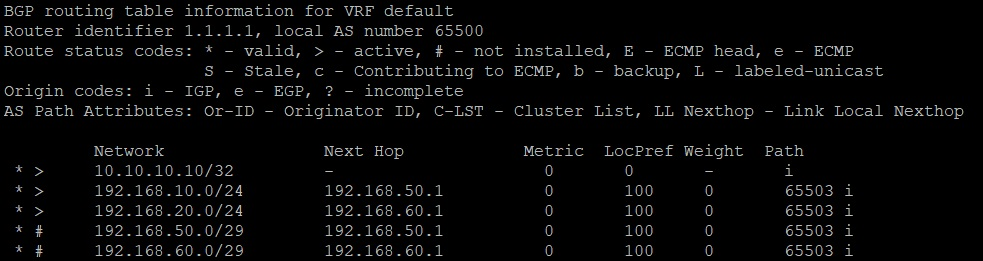
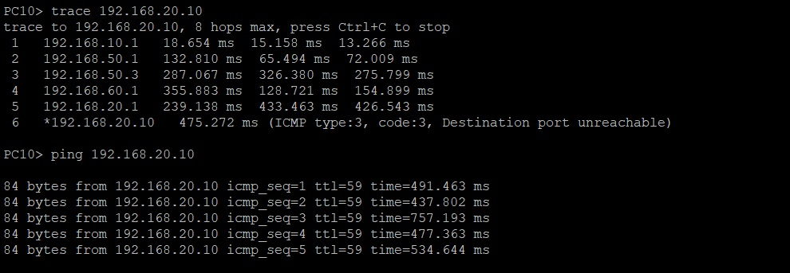

# Лабораторная работа №8. VxLAN Routing

## Цель

Реализовать передачу суммарных префиксов через EVPN route-type 5.

## Постановка задачи

1. Разместите двух "клиентов" в разных VRF в рамках одной фабрики.
2. Настроите маршрутизацию между клиентами через внешнее устройство (граничный роутер\фаерволл\etc)
3. Зафиксируете в документации - план работы, адресное пространство, схему сети, настройки сетевого оборудования


## Описание задачи

За основу взять стенд из лабораторной работы №6. Подсоединить дополнительное устройство к произвольному Leaf маршрутизатору, передать с данного устройства (назовем его 
граничным устройством BGW) через EVPN перфикс route-type 5. Обеспечись видимость данного префикса из всех Bridge доменов. Обеспечить маршрутизацию через данное граничное
устройство.

# Введение

В качестве исходной сети, возьмем сеть из лабораторной работы №6 с уже настроенным Underlay и Overlay на основе eBGP. Подключим еще маршрутизатор, и обозначим на нем роль
шраничного шлюза сети.

## Оборудование

1. Виртуальный коммутатор окружения Eve-NG на базе операционной системы vEOS версии EOS-4.29.2F
2. Виртуальный хост окружения Eve-NG

## Терминология

- VRF (Virtual Routing and Forwarding) — это технология, позволяющая иметь несколько независимых таблиц маршрутизации на одном маршрутизаторе

## Именование и термины

В качестве исходной сети была использована ранее спроектированная лабораторная сеть из Лаборатоной роботы №4. Все сетевые устройства имеют свои уникальные имена, отражающие их
функциональное назначение:

- S1 - Spine коммутатор №1
- S2 - Spine коммутатор №2

- L1 - Leaf коммутатор №1
- L2 - Leaf коммутатор №2
- L3 - Leaf коммутатор №3

- PC10 - Виртуальный хост №1, подкчобенный к Leaf коммутатору №1. Принадледит VLAN10.
- PC20 - Виртуальный хост №2, подкчобенный к Leaf коммутатору №3. Принадледит VLAN20.
- BGW - Маршрутизатор имитирующий роль граничного устройства маршрутизации, подключенный к Leaf коммутатору №3 и №4 (обьеденены посредством EVPN Multihoming). Принадлежит 
транспортному VLAN50 и VLAN60.

### Таблица адресов сетевых устройств Spine

|N|Device|Port|IP Address|Prefix|
|:-:|:-:|:-:|:-:|:-:|
|1|S1|eth1|10.1.1.1|30|
|2|S1|eth2|10.1.2.1|30|
|3|S1|eth3|10.1.3.1|30|
|4|S1|eth4|10.1.4.1|30|
|5|S2|eth1|10.2.1.1|30|
|6|S2|eth2|10.2.2.1|30|
|7|S2|eth3|10.2.3.1|30|
|8|S2|eth4|10.2.4.1|30|

### Таблица адресов сетевых устройств Leaf и BGW

|N|Device|Int|IP Address|Prefix|
|:-:|:-:|:-:|:-:|:-:|
|1|L1|eth1|10.1.1.2|30|
|2|L1|eth2|10.2.1.2|30|
|3|L1|eth8|192.168.10.1|30|
|4|L2|eth1|10.1.2.2|30|
|5|L2|eth2|10.2.2.2|30|
|6|L2|eth8|192.168.20.1|30|
|7|L3|eth1|10.1.3.2|30|
|8|L3|eth2|10.2.3.2|30|
|9|L3|vlan50|192.168.50.1|29|
|10|L3|vlan60|192.168.60.1|29|
|11|L4|eth1|10.1.4.2|30|
|12|L4|eth2|10.2.4.2|30|
|13|L4|vlan50|192.168.50.2|29|
|14|L4|vlan60|192.168.60.2|29|
|14|BGW|Po12|192.168.50.1|29|
|14|BGW|Po12|192.168.60.1|29|

### Таблица Loopback адресов сетевых устройств

|N|Device|Port|IP Address|Prefix|
|:-:|:-:|:-:|:-:|:-:|
|1|S1|Lo0|172.16.1.1|32|
|2|S2|Lo0|172.16.2.1|32|
|3|L1|Lo0|172.16.11.1|32|
|4|L2|Lo0|172.16.12.1|32|
|5|L3|Lo0|172.16.13.1|32|
|6|L4|Lo0|172.16.14.1|32|
|6|BGW|Lo0|10.10.10.10|32|

### Таблица адресов конечных устройств

|N|Device|Port|IP Address|Prefix|
|:-:|:-:|:-:|:-:|:-:|
|1|PC10|eth1|192.168.10.10|24|
|2|PC20|eth0|192.168.20.10|24|
|3|BGW|eth1|192.168.50.3|24|

### Таблица принадлежности конечных устройств соответствующим VLAN

|N|Device|VLAN ID|IP Address|Prefix|
|:-:|:-:|:-:|:-:|:-:|
|1|PC10|VLAN 10|192.168.10.0|24|
|2|PC20|VLAN 20|192.168.20.0|24|
|3|BGW|VLAN 50|192.168.50.0|29|
|4|BGW|VLAN 50|192.168.60.0|29|

## Описание стенда

В рамках лабораторной работы на предоставленном учебным центром лабораторном окружении было использовано шесть коммутаторов. Данные коммутаторы были соеденины линиями связи по
схеме CLOS, два из которых (S1 и S2) выступают в качестве Spine устройств, и три (L1,L2,L3 и L4) в качестве Leaf устройств. Схема сети в рамках лабораторного окружения представлена
на рисунке ниже



## Настройка устройств

В рамках учебной лабораторной среды на всех сетевых устройствах был настроен протокол EVPN VXLAN поверх Underlay сети с импользованием eBGP протокола. Так как в качестве UNDERLAY
сети был взят протокол eBGP, все Spine устройства находятся в одной автономной системе (AS65550), в то время как каждое устройство Leaf находится в своей автономной системе 
(AS65501-AS65549). На каждом из Leaf устройст был поднят свой NVE, произведены настройки EVPN XVLAN, а так же настройены соответствующие VLAN, которые и будут масштабироваться 
между Leaf устройствами. Устройства Leaf L3 и L4 были объеденины посредством EVPN Multihoming.


Ниже приведены частичные настройки файлов конфигураций сетевых устройств:

#### Spine устройства

**S1**

```
service routing protocols model multi-agent
!
hostname S1
!
interface Ethernet1
   description <leaf L1>
   mtu 9214
   no switchport
   ip address 10.1.1.1/30
!
interface Ethernet2
   description <leaf L2>
   mtu 9214
   no switchport
   ip address 10.1.2.1/30
!
interface Ethernet3
   description <leaf L3>
   mtu 9214
   no switchport
   ip address 10.1.3.1/30
!
interface Ethernet4
   description <leaf L4>
   mtu 9214
   no switchport
   ip address 10.1.4.1/30
!
interface Loopback0
   ip address 172.16.1.1/32
!
ip routing
!
peer-filter LEAFS_ASN
   10 match as-range 65501-65504 result accept
!
router bgp 65550
   router-id 1.0.1.1
   no bgp default ipv4-unicast
   timers bgp 1 3
   distance bgp 20 200 200
   maximum-paths 2 ecmp 2
   bgp listen range 172.16.0.0/16 peer-group EVPN peer-filter LEAFS_ASN
   bgp listen range 10.0.0.0/8 peer-group LEAF peer-filter LEAFS_ASN
   neighbor EVPN peer group
   neighbor EVPN next-hop-unchanged
   neighbor EVPN update-source Loopback0
   neighbor EVPN ebgp-multihop 3
   neighbor EVPN send-community extended
   neighbor LEAF peer group
   neighbor LEAF out-delay 0
   neighbor LEAF bfd
   neighbor LEAF password 7 CFF54tD4K3HqNxXFU7fUvg==
   !
   address-family evpn
      neighbor EVPN activate
   !
   address-family ipv4
      neighbor LEAF activate
      network 172.16.1.1/32
!
end
```

**S2**

```
service routing protocols model multi-agent
!
hostname S2
!
interface Ethernet1
   description <leaf L1>
   mtu 9214
   no switchport
   ip address 10.2.1.1/30
!
interface Ethernet2
   description <leaf L2>
   mtu 9214
   no switchport
   ip address 10.2.2.1/30
!
interface Ethernet3
   description <leaf L3>
   mtu 9214
   no switchport
   ip address 10.2.3.1/30
!
interface Ethernet4
   description <leaf L4>
   mtu 9214
   no switchport
   ip address 10.2.4.1/30
!
interface Loopback0
   ip address 172.16.2.1/32
!
ip routing
!
peer-filter LEAFS_ASN
   10 match as-range 65501-65504 result accept
!
router bgp 65550
   router-id 1.0.1.2
   no bgp default ipv4-unicast
   timers bgp 1 3
   distance bgp 20 200 200
   maximum-paths 2 ecmp 2
   bgp listen range 172.16.0.0/16 peer-group EVPN peer-filter LEAFS_ASN
   bgp listen range 10.0.0.0/8 peer-group LEAF peer-filter LEAFS_ASN
   neighbor EVPN peer group
   neighbor EVPN next-hop-unchanged
   neighbor EVPN update-source Loopback0
   neighbor EVPN ebgp-multihop 3
   neighbor EVPN send-community extended
   neighbor LEAF peer group
   neighbor LEAF out-delay 0
   neighbor LEAF bfd
   neighbor LEAF password 7 CFF54tD4K3HqNxXFU7fUvg==
   !
   address-family evpn
      neighbor EVPN activate
   !
   address-family ipv4
      neighbor LEAF activate
      network 172.16.2.1/32
!
end
```

#### Leaf устройства

**L1**

```
service routing protocols model multi-agent
!
no logging console
no logging monitor
!
hostname L1
!
vlan 10
   name VLAN10
!
vrf instance VRF1
!
interface Ethernet1
   description <spine S1>
   mtu 9214
   no switchport
   ip address 10.1.1.2/30
!
interface Ethernet2
   description <spine S2>
   mtu 9214
   no switchport
   ip address 10.2.1.2/30
!
interface Ethernet8
   description <PC10>
   mtu 9214
   switchport access vlan 10
!
interface Loopback0
   ip address 172.16.11.1/32
!
interface Vlan10
   description <User`s VLAN10>
   vrf VRF1
   ip address virtual 192.168.10.1/24
!
interface Vxlan1
   vxlan source-interface Loopback0
   vxlan udp-port 4789
   vxlan vlan 10 vni 10010
   vxlan vrf VRF1 vni 111111
   vxlan learn-restrict any
!
ip virtual-router mac-address aa:11:00:00:00:00
!
ip routing
ip routing vrf VRF1
!
router bgp 65501
   router-id 1.0.0.1
   no bgp default ipv4-unicast
   timers bgp 1 3
   distance bgp 20 200 200
   maximum-paths 2 ecmp 2
   neighbor EVPN peer group
   neighbor EVPN remote-as 65550
   neighbor EVPN update-source Loopback0
   neighbor EVPN ebgp-multihop 3
   neighbor EVPN send-community extended
   neighbor SPINE peer group
   neighbor SPINE remote-as 65550
   neighbor SPINE out-delay 0
   neighbor SPINE password 7 TELv/X/TsJAOPeWXSZ/FGA==
   neighbor 10.1.1.1 peer group SPINE
   neighbor 10.2.1.1 peer group SPINE
   neighbor 172.16.1.1 peer group EVPN
   neighbor 172.16.2.1 peer group EVPN
   !
   vlan 10
      rd auto
      route-target both 10:10010
      redistribute learned
   !
   address-family evpn
      neighbor EVPN activate
   !
   address-family ipv4
      neighbor SPINE activate
      network 172.16.11.1/32
   !
   vrf VRF1
      rd 65501:1
      route-target import evpn 1:111111
      route-target export evpn 1:111111
      redistribute connected
!
end
```

**L2**

```
service routing protocols model multi-agent
!
no logging console
no logging monitor
!
hostname L2
!
vlan 20
   name VLAN20
!
vrf instance VRF2
!
interface Ethernet1
   description <spine S1>
   mtu 9214
   no switchport
   ip address 10.1.2.2/30
!
interface Ethernet2
   description <spine S2>
   mtu 9214
   no switchport
   ip address 10.2.2.2/30
!
interface Ethernet8
   description <PC20>
   mtu 9214
   switchport access vlan 20
!
interface Loopback0
   ip address 172.16.12.1/32
!
interface Vlan20
   description <User`s VLAN20>
   vrf VRF2
   ip address virtual 192.168.20.1/24
!
interface Vxlan1
   vxlan source-interface Loopback0
   vxlan udp-port 4789
   vxlan vlan 20 vni 10020
   vxlan vrf VRF2 vni 222222
   vxlan learn-restrict any
!
ip virtual-router mac-address aa:11:00:00:00:00
!
ip routing
ip routing vrf VRF2
!
router bgp 65502
   router-id 1.0.0.2
   no bgp default ipv4-unicast
   timers bgp 1 3
   distance bgp 20 200 200
   maximum-paths 2 ecmp 2
   neighbor EVPN peer group
   neighbor EVPN remote-as 65550
   neighbor EVPN update-source Loopback0
   neighbor EVPN ebgp-multihop 3
   neighbor EVPN send-community extended
   neighbor SPINE peer group
   neighbor SPINE remote-as 65550
   neighbor SPINE out-delay 0
   neighbor SPINE password 7 TELv/X/TsJAOPeWXSZ/FGA==
   neighbor 10.1.2.1 peer group SPINE
   neighbor 10.2.2.1 peer group SPINE
   neighbor 172.16.1.1 peer group EVPN
   neighbor 172.16.2.1 peer group EVPN
   !
   vlan 20
      rd auto
      route-target both 20:10020
      redistribute learned
   !
   address-family evpn
      neighbor EVPN activate
   !
   address-family ipv4
      neighbor SPINE activate
      network 172.16.12.1/32
   !
   vrf VRF2
      rd 65502:2
      route-target import evpn 2:222222
      route-target export evpn 2:222222
      redistribute connected
!
end
```

**L3**

```
hostname L3
!
vlan 10
   name VLAN10
!
vlan 20
   name VLAN20
!
vlan 50
   name TRANSPORT_VLAN10
!
vlan 60
   name TRANSPORT_VLAN20
!
vrf instance VRF1
!
vrf instance VRF2
!
interface Port-Channel8
   switchport mode trunk
   !
   evpn ethernet-segment
      identifier 0000:0000:0000:0000:1111
      route-target import 00:00:00:00:11:11
   lacp system-id 1111.2222.3333
!
interface Ethernet1
   description <spine S1>
   mtu 9214
   no switchport
   ip address 10.1.3.2/30
!
interface Ethernet2
   description <spine S2>
   mtu 9214
   no switchport
   ip address 10.2.3.2/30
!
interface Ethernet8
   description <BGW>
   mtu 9214
   channel-group 8 mode active
!
interface Loopback0
   ip address 172.16.13.1/32
!
interface Loopback1
   ip address 10.0.0.100/32
!
interface Vlan10
   description <User`s VLAN 10>
   vrf VRF1
   ip address virtual 192.168.10.1/24
!
interface Vlan20
   description <User`s VLAN 20>
   vrf VRF2
   ip address virtual 192.168.20.1/24
!
interface Vlan50
   description <Transport for VLAN10>
   vrf VRF1
   ip address 192.168.50.1/29
!
interface Vlan60
   description <Transport for VLAN20>
   vrf VRF2
   ip address 192.168.60.1/29
!
interface Vxlan1
   vxlan source-interface Loopback1
   vxlan udp-port 4789
   vxlan vlan 10 vni 10010
   vxlan vlan 20 vni 10020
   vxlan vlan 50 vni 10050
   vxlan vlan 60 vni 10060
   vxlan vrf VRF1 vni 111111
   vxlan vrf VRF2 vni 222222
   vxlan learn-restrict any
!
ip virtual-router mac-address aa:11:00:00:00:00
!
ip routing
ip routing vrf VRF1
ip routing vrf VRF2
!
router bgp 65503
   router-id 1.0.0.3
   no bgp default ipv4-unicast
   timers bgp 1 3
   distance bgp 20 200 200
   maximum-paths 2 ecmp 2
   neighbor EVPN peer group
   neighbor EVPN remote-as 65550
   neighbor EVPN update-source Loopback0
   neighbor EVPN ebgp-multihop 3
   neighbor EVPN send-community extended
   neighbor SPINE peer group
   neighbor SPINE remote-as 65550
   neighbor SPINE out-delay 0
   neighbor SPINE password 7 TELv/X/TsJAOPeWXSZ/FGA==
   neighbor 10.1.3.1 peer group SPINE
   neighbor 10.2.3.1 peer group SPINE
   neighbor 172.16.1.1 peer group EVPN
   neighbor 172.16.2.1 peer group EVPN
   !
   vlan 10
      rd auto
      route-target both 10:10010
      redistribute learned
   !
   vlan 20
      rd auto
      route-target both 20:10020
      redistribute learned
   !
   vlan 50
      rd auto
      route-target both 50:10050
      redistribute learned
   !
   vlan 60
      rd auto
      route-target both 60:10060
      redistribute learned
   !
   address-family evpn
      neighbor EVPN activate
   !
   address-family ipv4
      neighbor SPINE activate
      network 10.0.0.100/32
      network 172.16.13.1/32
   !
   vrf VRF1
      rd 65503:1
      route-target import evpn 1:111111
      route-target export evpn 1:111111
      neighbor 192.168.50.3 remote-as 65500
      redistribute connected
      !
      address-family ipv4
         neighbor 192.168.50.3 activate
   !
   vrf VRF2
      rd 65503:2
      route-target import evpn 2:222222
      route-target export evpn 2:222222
      neighbor 192.168.60.3 remote-as 65500
      redistribute connected
      !
      address-family ipv4
         neighbor 192.168.60.3 activate
!
end
```

**L4**

```
no logging console
no logging monitor
!
hostname L4
!
vlan 10
   name VLAN10
!
vlan 20
   name VLAN20
!
vlan 50
   name TRANSPORT_VLAN10
!
vlan 60
   name TRANSPORT_VLAN20
!
vrf instance VRF1
!
vrf instance VRF2
!
interface Port-Channel8
   switchport mode trunk
   !
   evpn ethernet-segment
      identifier 0000:0000:0000:0000:1111
      route-target import 00:00:00:00:11:11
   lacp system-id 1111.2222.3333
!
interface Ethernet1
   description <spine S1>
   mtu 9214
   no switchport
   ip address 10.1.4.2/30
!
interface Ethernet2
   description <spine S2>
   mtu 9214
   no switchport
   ip address 10.2.4.2/30
!
interface Ethernet8
   description <BGW>
   mtu 9214
   channel-group 8 mode active
!
interface Loopback0
   ip address 172.16.14.1/32
!
interface Loopback1
   ip address 10.0.0.100/32
!
interface Vlan10
   description <User`s VLAN 10>
   vrf VRF1
   ip address virtual 192.168.10.1/24
!
interface Vlan20
   description <User`s VLAN 20>
   vrf VRF2
   ip address virtual 192.168.20.1/24
!
interface Vlan50
   description <Transport for VLAN10>
   vrf VRF1
   ip address 192.168.50.2/29
!
interface Vlan60
   description <Transport for VLAN20>
   vrf VRF2
   ip address 192.168.60.2/29
!
interface Vxlan1
   vxlan source-interface Loopback1
   vxlan udp-port 4789
   vxlan vlan 10 vni 10010
   vxlan vlan 20 vni 10020
   vxlan vlan 50 vni 10050
   vxlan vlan 60 vni 10060
   vxlan vrf VRF1 vni 111111
   vxlan vrf VRF2 vni 222222
   vxlan learn-restrict any
!
ip virtual-router mac-address aa:11:00:00:00:00
!
ip routing
ip routing vrf VRF1
ip routing vrf VRF2
!
router bgp 65504
   router-id 1.0.0.4
   no bgp default ipv4-unicast
   timers bgp 1 3
   distance bgp 20 200 200
   maximum-paths 2 ecmp 2
   neighbor EVPN peer group
   neighbor EVPN remote-as 65550
   neighbor EVPN update-source Loopback0
   neighbor EVPN ebgp-multihop 3
   neighbor EVPN send-community extended
   neighbor SPINE peer group
   neighbor SPINE remote-as 65550
   neighbor SPINE out-delay 0
   neighbor SPINE password 7 TELv/X/TsJAOPeWXSZ/FGA==
   neighbor 10.1.4.1 peer group SPINE
   neighbor 10.2.4.1 peer group SPINE
   neighbor 172.16.1.1 peer group EVPN
   neighbor 172.16.2.1 peer group EVPN
   !
   vlan 10
      rd auto
      route-target both 10:10010
      redistribute learned
   !
   vlan 20
      rd auto
      route-target both 20:10020
      redistribute learned
   !
   vlan 50
      rd auto
      route-target both 50:10050
      redistribute learned
   !
   vlan 60
      rd auto
      route-target both 60:10060
      redistribute learned
   !
   address-family evpn
      neighbor EVPN activate
   !
   address-family ipv4
      neighbor SPINE activate
      network 10.0.0.100/32
      network 172.16.14.1/32
   !
   vrf VRF1
      rd 65504:1
      route-target import evpn 1:111111
      route-target export evpn 1:111111
      neighbor 192.168.50.3 remote-as 65500
      redistribute connected
      !
      address-family ipv4
         neighbor 192.168.50.3 activate
   !
   vrf VRF2
      rd 65504:2
      route-target import evpn 2:222222
      route-target export evpn 2:222222
      neighbor 192.168.60.3 remote-as 65500
      redistribute connected
      !
      address-family ipv4
         neighbor 192.168.60.3 activate
!
end
```

**BGW**

```
hostname BGW
!
spanning-tree mode mstp
!
vlan 50
   name TRANSPORT_VLAN10
!
vlan 60
   name TRANSPORT_VLAN20
!
interface Port-Channel12
   switchport mode trunk
!
interface Ethernet1
   description <leaf L3>
   mtu 9214
   channel-group 12 mode active
!
interface Ethernet2
   description <leaf L4>
   mtu 9214
   channel-group 12 mode active
!
interface Loopback0
   ip address 10.10.10.10/32
!
interface Vlan50
   description <Transport for VLAN10>
   ip address 192.168.50.3/29
!
interface Vlan60
   description <Transport for VLAN20>
   ip address 192.168.60.3/29
!
ip routing
!
router bgp 65500
   router-id 1.1.1.1
   neighbor 192.168.50.1 remote-as 65503
   neighbor 192.168.50.1 remove-private-as all replace-as
   neighbor 192.168.50.2 remote-as 65504
   neighbor 192.168.50.2 remove-private-as all replace-as
   neighbor 192.168.60.1 remote-as 65503
   neighbor 192.168.60.1 remove-private-as all replace-as
   neighbor 192.168.60.2 remote-as 65504
   neighbor 192.168.60.2 remove-private-as all replace-as
   network 10.10.10.10/32
!
end
```

## Описание типовых настроек

За прототип возьмем лабораторную работу №6. Нет смысла описывать настройки Spine S1 и S2, так как они являются типовыми. Следует отметить лишь то, что у них пояавился дополнительный
линк до машрутизатора L4, со совей адресацией указанной в тиблице выше. 

На маршрутищаторе L1 клиент PC10, подключенный к Eth8, принадлежит Bridge домену VLAN10, который в свою очередь принадлежит отдельной таблице маршрутизации на виртуальном 
маршрутизаторе VRF1. В интерфейсе VXLAN 1 данная таблица маршрутизации имеет VNI 111111.

На маршрутищаторе L2 клиент PC20, подключенный к Eth8, принадлежит Bridge домену VLAN20, который в свою очередь принадлежит отдельной таблице маршрутизации на виртуальном
маршрутизаторе VRF1. В интерфейсе VXLAN 1 данная таблица маршрутизации имеет VNI 222222.

В рамках единой Multihoming сущности, состоящей из двух leaf машрутизаторов L3 и L4 данные VNI (111111 и 222222) принадлежат отдельным таблицам маршрутизации VFR1 и VRF2 
соответственно, как следствие невозможне достеп в рамках двух Bridge доменов VLAN10 И VLAN20.

Для организации маршрутизации в рамках двух данных Bridge доменов мы будем использовать отдельный граничный маршрутизатор, выступающий в роли forwarding устройства. Для этого на
машрутизаторах L3 и L4 создадим два промежуточных VLAN, с vlan id 50 для VLAN10 и vlan id 60 для VLAN20. Через эти транспортные VLAN гриничный маршрутизатор будет взаимодествовать
с отдельными vrf на наших leaf машрутизаторах. Для обмена данными поднимим на нем отдельныю eBGP сессию, в которой в качестве других участников обмена данными укажем ip адреса
транспортных VLAN (см. Таблица адресов сетевых устройств Leaf и BGW). В качествено внешнего перфикса будем транслировать в Spine-Leaf сеть ip адрес Loopback интерфейса устройства
BGW, имеющий адрес 10.10.10.10/32. Данный адрес будет распространяться в рамках EVPN route type 5 сообщения.

В следствии того, что eBGP сессия на устройстве BGW будет установлена со своими VRF сущностями в рамках eBGP сессий на устройствах L3 и L4, к нему попадут машруты до сетей Bridge
доменов VLAN10 и VLAN20.

Следует так же отметить, что в силу особенностей протокола BGP мы не сможем организровать машрутизацию между данными Brodge доменами, так как фактически запрос от L3 или L4 будет
возвращаться им же. Такие пакеты BGP сессия отбросит, запустив протокол разрыва петель (пакет с аналогичным номером AS будет отбрасываться). Для устранения данного препятсивя 
используем механизм перезаписи номера автономной системы на устройстве BGW. 

# Заключение

## Проверка работы сденда и результаты работы

Стенд может считаться рабочим в случае установления L3 связности в рамках двух Bridge доменов VLAN10 (Leaf маршрутизатор L1) и VLAN20 (Leaf маршрутизатор L2) через граничное
устройство BGW (Leaf маршрутизаторы L3 и L4). Так же отследим получение распространяемый EVPN route-type 5 маршрута на leaf машрутизаторах. 

**Префикс-лист и таблица адресов EVPN BGP маршрутов на устройстве L1 и L2**








Как видим устройство L1 (VLAN10) и устройство L2 (VLAN20) имеют связность с VLAN10,VLAN20, а так же транспортными VLAN50 и VLAN60 на устройствах L3 и L4. Кроме того устройства
получили внешний машрут 10.10.10.10/32







Между устройствами L3, L4 и BGW так же имеется связность. Так же можно видеть, что на устройстве BGW присутствует информация по маршрутам до сетей Bridge доменов VLAN10 и VLAN20. 

**Получение ECHO ICMP ответа от устройств PC10 до PC20**



Как видим каждое устройство PC10 из Bridge домена VLAN10 c адресом сети 192.168.10.0/24 получило доступ к устройству PC20 из Bridge домена VLAN20 c адресом сети 192.168.20.0/24
через граничное устройство BGW.

## Вывод

Была проведена работа по настройке L3 связности в рамках двух Bridge доменов VLAN10 и VLAN20 через граничное устройство BGW.